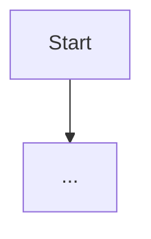

# Dogłębna analiza metody

## Wejście

Metoda do analizy: $ARGUMENTS

Jeśli wejście jest niejednoznaczne, zadaj maksymalnie 2 krótkie pytania doprecyzowujące.

## Co zrobić

1. Znajdź metodę w kodzie projektu (Glob + Grep + Read)
2. Zidentyfikuj metodę docelową i jej kontekst (klasa, adnotacje, interfejsy)
3. Rozwiń zależności: wywołania wewnętrzne, zewnętrzne, Spring beans, repozytoria
4. Opisz przepływ sterowania krok po kroku
5. Wykryj code smells i ryzyka bezpieczeństwa

## Wymagany format odpowiedzi

### 1) Cel metody
Krótko: za co odpowiada i w jakim scenariuszu jest używana.

### 2) Zależności i kontekst
Lista najważniejszych zależności z rolą każdej.

### 3) Flow wykonania (krok po kroku)
Numerowana lista kroków. Dla warunków: kiedy aktywuje się dana gałąź.

### 4) Diagram Mermaid

### 5) Ryzyka i problemy

**Code smells** (Severity: Low/Medium/High | Evidence | Impact | Recommendation)

**Bezpieczeństwo** (Severity | Evidence | Impact | Recommendation)

### 6) Szybkie rekomendacje refaktoryzacji
3-7 punktów priorytetizowanych od najważniejszych.

## Zasady

- Nie zgaduj: jeśli czegoś nie da się potwierdzić, oznacz jako "hipoteza"
- Odwołuj się do realnych symboli z kodu
- Pisz konkretnie i zwięźle
