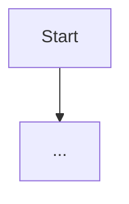

Przeprowadź **dogłębną analizę jednej metody** wskazanej przez użytkownika.

## Wejście
- Metoda docelowa (np. pełna sygnatura, nazwa klasy + nazwa metody, albo zaznaczony fragment kodu).
- Opcjonalnie: limit głębokości zależności (`1`, `2`, `3+`) i obszar (np. tylko `src/main/java`).

Jeśli wejście jest niejednoznaczne, najpierw zadaj maksymalnie 2 krótkie pytania doprecyzowujące.

## Co masz zrobić
1. Zidentyfikuj metodę docelową i jej kontekst (klasa, interfejs, nadpisania, adnotacje).
2. Rozwiń zależności wykonania:
   - wywołania metod wewnętrznych i zewnętrznych,
   - zależności przez DI (Spring beans), repozytoria, serwisy, klienty,
   - istotne obiekty danych i transformacje.
3. Opisz przepływ sterowania krok po kroku (ścieżka główna + ważne warianty i warunki).
4. Wykryj problemy jakości i bezpieczeństwa, zwłaszcza:
   - code smells (zbyt duża odpowiedzialność, duplikacja, złożoność, ukryte efekty uboczne),
   - ryzyka bezpieczeństwa (brak walidacji wejścia, niebezpieczne logowanie danych, potencjalne NPE/DoS, niejawne zaufanie do danych).
5. Zaproponuj konkretne, minimalne usprawnienia.

## Wymagany format odpowiedzi
Zwróć odpowiedź **dokładnie** w sekcjach poniżej:

### 1) Cel metody
- Krótko: za co odpowiada metoda i w jakim scenariuszu jest używana.

### 2) Zależności i kontekst
- Lista najważniejszych zależności (klasy, metody, bean-y, repozytoria, DTO/encje).
- Dla każdej pozycji: rola + wpływ na wynik metody.

### 3) Flow wykonania (krok po kroku)
- Numerowana lista kroków.
- Dla warunków podaj, kiedy aktywuje się dana gałąź.

### 4) Diagram przepływu (Markdown + Mermaid)
Wygeneruj diagram w bloku:

W diagramie uwzględnij:
- wejście,
- kluczowe decyzje (`if/else`, walidacje),
- wywołania zależności,
- zakończenia (sukces/błąd).

### 5) Ryzyka i problemy
Podziel na dwie podsekcje:
- **Code smells**
- **Bezpieczeństwo**

Każdy punkt ma mieć:
- `Severity`: `Low | Medium | High`
- `Evidence`: konkret (symbol/fragment zachowania)
- `Impact`: co może pójść źle
- `Recommendation`: minimalna poprawka

### 6) Szybkie rekomendacje refaktoryzacji
- 3-7 punktów, priorytetyzowane od najważniejszych.

## Zasady jakości
- Nie zgaduj: jeśli czegoś nie da się potwierdzić, oznacz jako "hipoteza".
- Odwołuj się do realnych symboli z kodu.
- Pisz konkretnie i zwięźle.
- Jeśli nie wykryjesz istotnych problemów, sekcja „Ryzyka i problemy” ma to jawnie stwierdzać.
