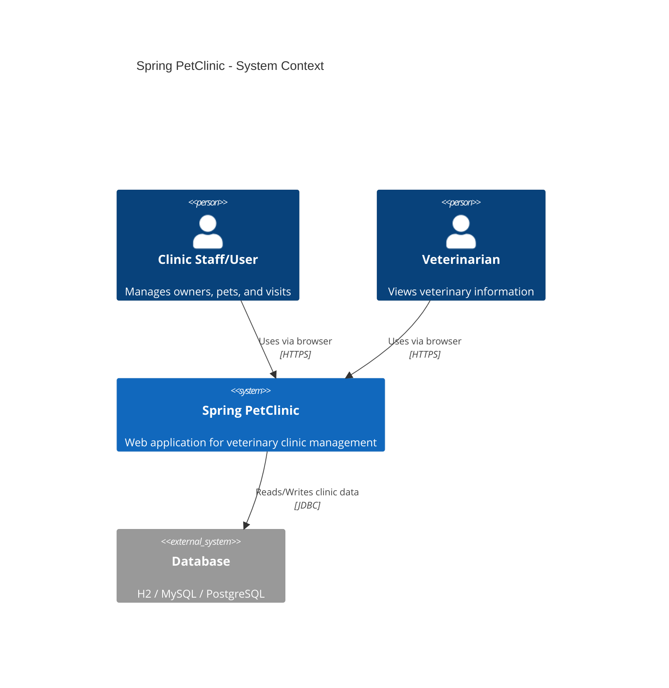
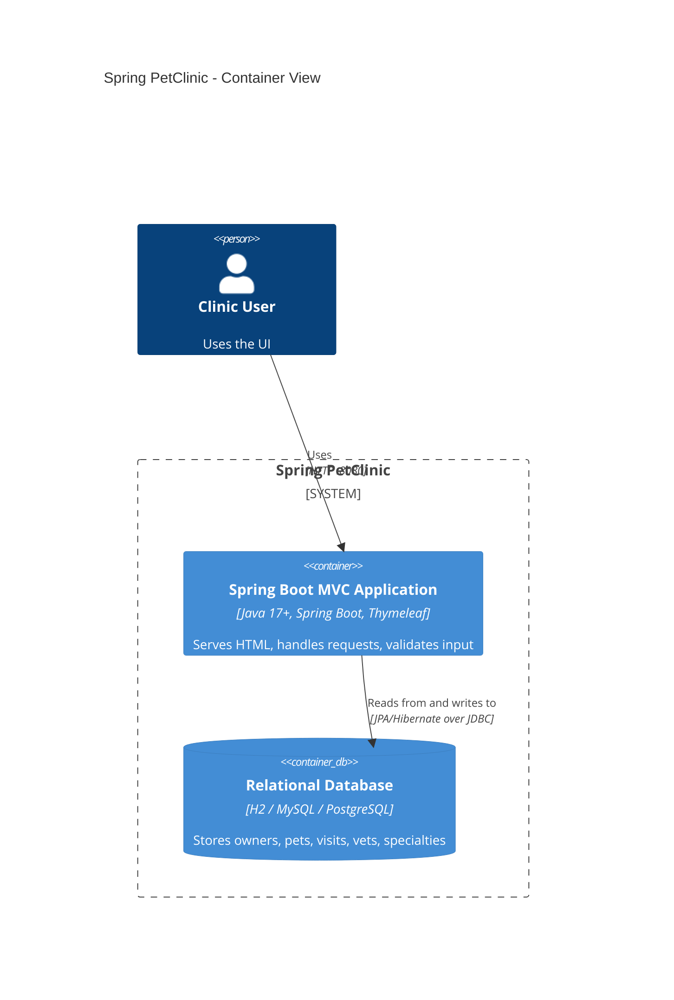
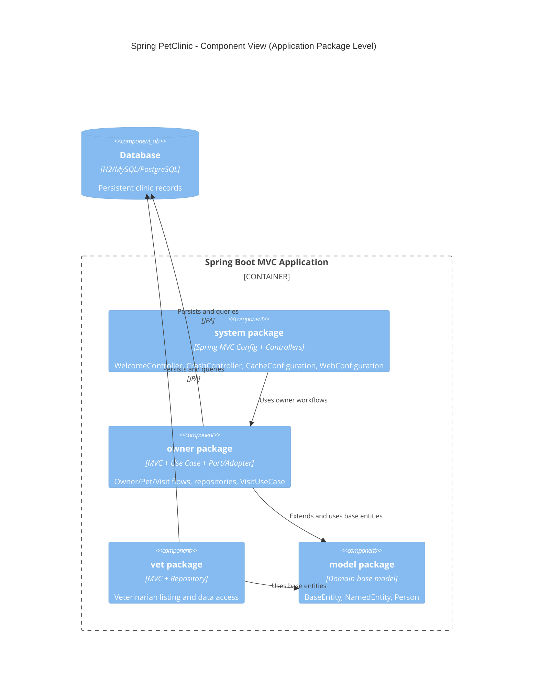

# Architecture

## Architectural Overview

Spring PetClinic is primarily an MVC web application built with Spring Boot and Spring Data JPA.  
Most features follow a layered model (`Controller -> Use Case/Repository -> Database`).

Inside the `owner` area, the visit flow additionally applies a lightweight hexagonal style:

- `VisitOwnerPort` defines a domain-facing port
- `OwnerRepositoryVisitAdapter` implements the port
- `VisitUseCase` orchestrates domain behavior

## C4 Context Diagram

## C4 Container Diagram

## C4 Component Diagram

## Architectural Patterns

### MVC (Primary Pattern)

- Controllers handle request routing and validation boundaries.
- Views are rendered by Thymeleaf templates.
- Repositories and use-case components coordinate persistence and business flow.

### Hexagonal Influence in `owner` Visit Flow

- Port: `VisitOwnerPort`
- Adapter: `OwnerRepositoryVisitAdapter`
- Application service: `VisitUseCase`

This keeps visit orchestration decoupled from direct repository implementation details.

## Layered Flow

Typical execution path:

1. **Controller layer** receives web request and performs request-level validation.
2. **Use case / repository layer** executes business logic and persistence operations.
3. **Database layer** stores and retrieves domain data.
