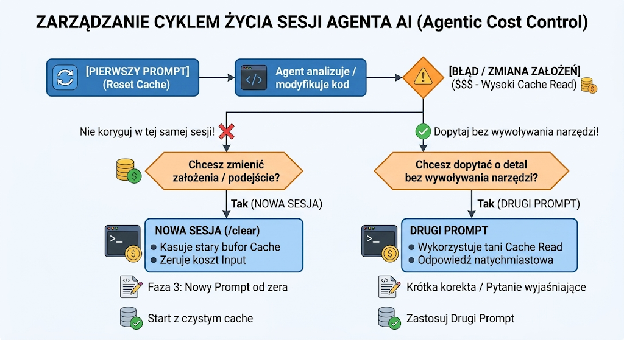

# **Know-How: Optymalizacja Zużycia i Kosztów Tokenów w Augment Code / Środowiskach Agentowych**

> **Erratum (2026-08-11).** Dokument przeszedł weryfikację względem zmierzonych
> danych z [context-economy.md](context-economy.md). Poprawiono trzy rzeczy,
> a jedna rada została przeformułowana — miejsca są oznaczone w tekście jako
> **KOREKTA**. Zestawienie zmian: [README.md § Errata](README.md#errata).

## **1\. Fundamenty Teoretyczne: Architektura LLM i Struktura Kosztów**

### **Bezstanowość LLM i Efekt Akumulacji Wieloturowej (Multi-turn Accumulation)**

* **Bezstanowość (Statelessness):** Modele LLM nie posiadają pamięci podręcznej "w głowie". Każde pojedyncze zapytanie lub pod-krok agenta (*tool call*) wymaga ponownego przesłania **całej dotychczasowej historii konwersacji** wraz ze zwracanymi wynikami z konsoli (STDOUT/STDERR).  
* **Mechanika Prompt Caching:**  
  * Wyszczególniamy cztery typy tokenów: **Input**, **Output**, **Cache Write** oraz **Cache Read**.  
  * Odczyt z pamięci podręcznej (**Cache Read**) jest jednostkowo tani – wynosi przykładowo **$0.26 / 1M tokenów** dla GLM-5.2 (ok. 18.6% stawki bazowej Input).  
  * **Efekt Kuli Śnieżnej (Snowball Effect):** Gdy agent wykonuje autonomiczną pętlę ReAct (np. 30–100 wewnętrznych wywołań narzędzi), przy skumulowanym kontekście 100k tokenów model czyta cały ten kontekst przy każdym krok-po-kroku wywołaniu API. Wykonanie 30 turnów przy kontekście 100k daje sumarycznie **3 000 000 tokenów Cache Read**. Pasywny odczyt z cache zaczyna odpowiadać nawet za **80–90% końcowego rachunku za sesję**.  
* **Utrata Cache przy zmianie modelu:**  
  * Zmiana modelu w trakcie prowadzenia jednego wątku powoduje natychmiastowe unieważnienie bufora pamięci cache. Nowy model musi przetworzyć pełny skumulowany kontekst od zera jako drogi **Input**, co drastycznie podnosi koszty operacji.

### **Podatek Językowy (Language Tax)**

* Tokenizatory większości modeli są zoptymalizowane pod język angielski.  
* Pisanie promptów, komentarzy i dokumentacji po polsku zużywa średnio **1.42x więcej tokenów** niż tekst angielski o tym samym znaczeniu.  
* Narzut ten przekłada się na **\+42% wyższy koszt tej części kontekstu** i **zmniejszenie efektywnego okna kontekstowego o \~30%** (1/1.42 = 70.4%).

> **KOREKTA — skala efektu.** Mechanizm jest prawdziwy, ale **nie dotyczy
> 42% rachunku**. Zgodnie z pomiarem w [context-economy.md](context-economy.md)
> Twoja wiadomość to **0,5%** kosztu wywołania, a system prompt **7,1%**.
> Polski prompt podnosi więc **cały** rachunek o ~**0,21%**; nawet gdyby cały
> system prompt był po polsku — o ~**3,2%**.
>
> Dla porównania: jeden nieużywany serwer MCP to **~46 152 tokeny na każde
> wywołanie**. `optimizer-playbook.md` umieszcza „skracanie promptu" w tabeli
> *czego nie warto robić*, właśnie dlatego. **Zalecenie „pisz wyłącznie po
> angielsku" nie broni się rachunkiem** — optymalizuj katalog narzędzi i typy
> reguł, nie język dokumentacji.

### **Narzut Platformowy Augment Code (Service Fee)**

* Platforma Augment Code nalicza opłatę serwisową doliczaną do kosztów API modeli LLM, pokrywającą m.in. Context Engine (indeksowanie bazy kodu) oraz orkiestrację. Cennik publiczny podaje **40%**; **na podstawie naszych obserwacji efektywny narzut dla naszej oferty wynosi około 28%** — i taka stawka jest użyta w tabeli w sekcji 2.
* Przykładowo, przy budżecie 100$ per użytkownik i narzucie **28%**: opłata serwisowa zabiera **\~$21.88**, a na surowe tokeny API pozostaje **\~$78.12**.

> **KOREKTA — arytmetyka.** Wcześniejsza wersja podawała podział
> **$28.58 / $71.42**, co odpowiada narzutowi `28.58/71.42 =` **40%**, a nie
> deklarowanym 28%. Tabela stawek w sekcji 2 jest spójnie policzona z mnożnikiem
> **1.28** (sprawdzone we wszystkich 16 komórkach), więc to przykład był
> niespójny z resztą dokumentu, nie tabela.
>
> Przy narzucie 40% podział wynosiłby $71.42 / $28.58. Wybierz jedną stawkę
> i trzymaj się jej w całym dokumencie — a najlepiej zweryfikuj ją na własnym
> rachunku, bo jest to liczba specyficzna dla umowy.

### **Koszt Modelu \!= Koszt Realizacji Zadania (Cost per Intelligence)**

* Stawka jednostkowa modelu za 1M tokenów nie jest tożsama z całkowitym kosztem wykonania zadania.  
* Słabszy lub "tani" model może wpaść w pętlę 100+ błędnych kroków, generując dziesiątki milionów tokenów Cache Read.  
* Model o wyższej "inteligencji" lub z trybem intensywnego wnioskowania (*reasoning*) potrafi rozwiązać problem w 3–5 krokach, generując sumarycznie znacznie niższy rachunek.

## **2\. Zestawienie Stawek i Modeli w Augment Code (z 28% Service Fee)**

| Model | Input / 1M | Output / 1M | Cache Read / 1M | Cache Write / 1M | Uwagi / Wskaźnik Cost-per-Intelligence |
| :---- | :---- | :---- | :---- | :---- | :---- |
| **GLM-5.2** | **$1.79** ($1.40 base) | **$5.63** ($4.40 base) | **$0.33** ($0.26 base) | **$1.79** ($1.40 base) | Architektura MoE 753B, okno 1M tokenów. Najlepsze ROI w zadaniach agentowych/terminalowych. |
| **GPT-5.6 Luna** | **$1.28** ($1.00 base) | **$7.68** ($6.00 base) | **$0.13**($0.10 base) | **$1.60**($1.25 base) | Dobre do prostej automatyzacji; drogi Output sprawia, że przy generowaniu kodu jest nieopłacalny. |
| **Claude Sonnet 4.6** | **$3.84** ($3.00 base) | **$19.20** ($15.00 base) | **$0.38** ($0.30 base) | **$4.80(**$3.75 base) | Okno 200k tokenów. Przydatny przy bardzo precyzyjnym *tool calling* i ścisłych instrukcjach. |
| **Kimi K2.6** | **$1.22** ($0.95 base) | **$5.12**($4.00 base) | **$0.20**($ 0.16 base) | **$1.22**($ 0.95 base) | Bardzo tani model agentowy do prostych, mechanicznych poprawek. |

Źródło stawek: [https://docs.augmentcode.com/models/token-based-pricing](https://docs.augmentcode.com/models/token-based-pricing)

## **3\. Playbook Optymalizacji Kosztów dla Zespołu Programistów**

### **A. Zarządzanie Środowiskiem i Kontekstem Startowym (Pre-Execution)**

* **Wyłączanie zbędnych narzędzi i agentów:**  
  * Duża liczba aktywnie zdefiniowanych skilli, agentów i narzędzi generuje **kilkanaście do kilkudziesięciu tysięcy tokenów** "na dzień dobry" w samej definicji kontekstu startowego.  
  * Używaj wspieranych mechanizmów: `auggie tools remove <nazwa>` (trwale, zapisuje `removedTools` w `~/.augment/settings.json`) albo `--remove-tool <nazwa>` (jeden przebieg). Cofasz przez `auggie tools add <nazwa>`.  
  * Przekształcaj "luźne" agenty w modułowe pluginy i aktywuj tylko te potrzebne do danego zadania.  
* **Podawanie bezwzględnych i precyzyjnych ścieżek:**  
  * Zamiast podawać samą nazwę klasy lub modułu (co zmusza agenta do wykonania kosztownej pętli find / grep), zawsze wklejaj dokładną ścieżkę do pliku.  
* **Ustawianie właściwego typu reguł:**  
  * Najwyższy zwrot z pracy w całej tej sekcji, i za darmo: reguła 60 KB jako `type: always_apply` kosztuje **23 145 tokenów na wywołanie**, a jako `type: agent_requested` — **66**. Skill 123 KB kosztuje 66 tokenów dzięki progressive disclosure. Szczegóły: [optimizer-playbook.md § Step 4](optimizer-playbook.md).

> **KOREKTA — rząd wielkości.** Wcześniejsza wersja mówiła o „kilkuset
> tysiącach tokenów na dzień dobry". Zmierzone wartości
> ([context-economy.md](context-economy.md)) są **około dziesięciokrotnie**
> niższe:
>
> | Pozycja | Koszt stały |
> |---|---:|
> | Pełny katalog 30 narzędzi | **17 219** tok/wywołanie |
> | Cały stały prefiks (katalog + system prompt) | **24 269** tok/wywołanie |
> | Serwer MCP z ~50 narzędziami | **~46 152** tok/wywołanie |
>
> Usunięto też radę o **zmianie nazwy katalogu `agents`**: to obejście
> niepotwierdzone pomiarem, a `auggie tools remove` robi to samo w sposób
> wspierany i odwracalny.

### **B. Kontrola Pętli Agentowych (Execution & Prompt Engineering)**

* **Instalacja Twardych Zakazów Narzędziowych (Tool Restrictions):**  
  * W prompcie początkowym wyraźnie blokuj przeszukiwanie środowiska, jeśli nie jest potrzebne:  
  * CRITICAL CONSTRAINTS: DO NOT use shell commands (find, grep, git log, git branch) to explore repository. RESTRICT analysis strictly to provided files.  
* **Eliminacja konwersacyjnego szumu:**  
  * Wymuszaj na modelu formaty zwięzłe (Zero-Yapping / Brief Bullet Points), zakazując wstępów, podsumowań i zwrotów grzecznościowych.

### **C. Cykl Życia Sesji i Strategie Naprawcze (Session Lifecycle & Recovery)**

1. **Zasada Fail Fast (Szybkie przerywanie sesji):**  
   * Śledź wykonanie akcji agenta w panelu. Jeśli w logach zobaczysz, że wykonuje drugą lub trzecią komendę poszukiwawczą (np. find lub git diff), **natychmiast przerwij proces**. Z każdą sekundą koszt odczytu z cache rośnie kaskadowo.  
2. **Nie poprawiaj błędu w sesji zapchanej nieudanymi poszukiwaniami — ale resetuj z kondensatem, nie na pusto:**  
   * Dopisanie 5 słów korekty ("*zrobiłeś to dla X, a miało być dla Y*") zmusza model do ponownego odczytania całego zapchanego bufora (100k+ tokenów) w każdym kolejnym krok-po-kroku wywołaniu narzędzi.  
   * Zanim zresetujesz — zrób **context offloading** (punkt 4). Reset sam w sobie nic nie oszczędza; oszczędza **kondensacja** tego, co przenosisz dalej.  
3. **Bezwzględny zakaz zmiany modelu w trakcie trwania wątku:**  
   * **Nie przełączaj modelu z premium na tańszy w połowie rozmowy**. Przełączenie powoduje natychmiastowe skasowanie zniżki Cache Read i przeliczenie całego skumulowanego kontekstu po pełnej, wysokiej stawce Input.  
4. **Strategia Context Offloading / Memory Files:**  
   * Przed zamknięciem długiej sesji nakaż agentowi zrzucić skondensowane wnioski i stan prac do pliku Markdown.  
   * Otwórz **nową sesję** i wskaż jej wygenerowany plik Markdown jako jedyny kontekst startowy.  
   * Redukuje to wielkość wczytywanego kontekstu z **100k–150k tokenów** do **2k–5k tokenów**, oszczędzając do **90% kosztów** ponownej analizy.

> **KOREKTA — sprzeczność z `context-economy.md`, i jak ją rozstrzygnąć.**
>
> Ten dokument radził „**zawsze** resetuj sesję". [context-economy.md](context-economy.md)
> twierdzi coś przeciwnego: kończenie sesji wcześnie jest „**actively wrong**",
> a [optimizer-playbook.md](optimizer-playbook.md) wpisuje to do kolumny
> **Reject**. Obie strony mają rację, bo **mierzą co innego**.
>
> **Za radą A (nie resetuj):** historia to 94,5% cache read, a udział cache
> *rośnie* z długością sesji (75,8% w pierwszych 10 turach, 93–96% po 30).
> Historia osiąga plateau (~64 000 tokenów od 50. wywołania — działa okno
> przesuwne). Restart **przepłaca cache creation na całym prefiksie**.
>
> **Za radą B (resetuj):** cache read jest tani jednostkowo, ale
> 100 000 tokenów × 30 tur = **3 mln tokenów cache read**. Tanie razy dużo to
> nadal dużo.
>
> **Rozstrzygnięcie: nie chodzi o długość sesji, tylko o jej zawartość.**
>
> | Sytuacja | Decyzja |
> |---|---|
> | Długa sesja, historia nadal potrzebna | **Zostaw.** Cache pracuje dla Ciebie |
> | Sesja zapchana nieudanymi poszukiwaniami | **Offloading + `/new`** |
> | Drobna korekta w zdrowej sesji | **Popraw na miejscu.** Restart kosztuje więcej |
> | Zmiana modelu | **`/new` obowiązkowo** — cache i tak przepada (punkt 3) |
> | Nowe, niezwiązane zadanie | **`/new`.** Historia to balast |
>
> Restart z **pełnym** kontekstem to strata. Restart z **kondensatem** to
> wygrana. Wygrana pochodzi z kondensacji, nie z restartu.

