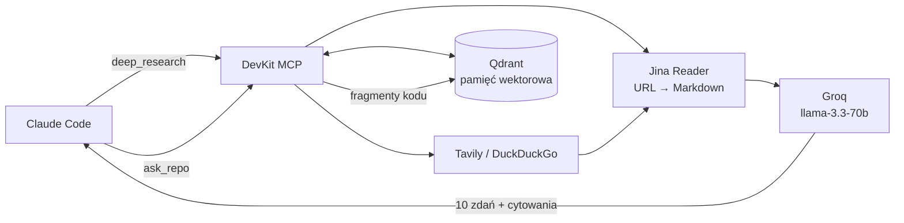

# DevKit MCP — RAG, pamięć wektorowa i sub-agent LLM w jednym serwerze

Serwer MCP, który zamienia asystenta w **system wyszukujący i przetwarzający wiedzę**:
szuka w sieci, czyta strony jako Markdown, pamięta wnioski między sesjami, odpowiada na
pytania o kod tego repo i deleguje mechaniczną robotę do szybkiego, taniego modelu.

W przeciwieństwie do `mcp_ex_api` (3 narzędzia demo) ten serwer wykorzystuje **pełną
powierzchnię protokołu MCP**: `tools` + `resources` + `prompts`.

---

## Dlaczego to działa — ekonomia kontekstu

Klasyczny przepływ: agent pobiera 5 stron dokumentacji → 40 tys. tokenów ląduje w Twoim
oknie kontekstu → reszta sesji jest droższa i głupsza.

Przepływ DevKit:



Surowe strony i logi przechodzą przez **tani** model. Do głównego okna wraca wynik,
nie materiał źródłowy.

---

## Szybki start

```bash
# 1. Zależności (w .venv projektu)
pip install -r szkol_referencja/copilot_training_self_paced/mcp_devkit/requirements.txt

# 2. Konfiguracja — WSZYSTKIE klucze są opcjonalne
cd szkol_referencja/copilot_training_self_paced/mcp_devkit
cp .env.example .env        # Windows: copy .env.example .env

# 3. Diagnostyka bez klienta MCP
python devkit_server.py --selftest

# 4. Test od strony klienta MCP (tak łączy się Claude Code)
python smoke_test.py                # offline + lokalne
python smoke_test.py --network      # dodatkowo Jina Reader i wyszukiwarka
```

Serwer jest już wpisany w `.mcp.json` (Claude Code) i `.vscode/mcp.json` (Copilot) jako
`devkit`. W Claude Code przy pierwszym uruchomieniu potwierdź serwer projektowy, potem:

```bash
claude mcp list      # devkit — ✔ Connected
```

Pierwsze uruchomienie pobiera model embeddingów (~130 MB) do cache HuggingFace.

---

## Narzędzia (tools)

| Narzędzie | Do czego | Wymaga |
|---|---|---|
| `web_search` | Wyszukiwanie przygotowane pod RAG (tytuł, URL, snippet, score) | nic (fallback DDG) |
| `read_page` | Dowolny URL → czysty Markdown, bez HTML-owego szumu | nic (limit bez klucza) |
| `deep_research` | szukaj → przeczytaj → zsyntetyzuj → zapamiętaj, w jednym wywołaniu | Groq dla syntezy |
| `memory_save` | Zapis wniosku/decyzji/pułapki, która ma przeżyć sesję | qdrant-client |
| `memory_search` | Wyszukiwanie semantyczne w pamięci agenta | qdrant-client |
| `memory_delete` | Usunięcie wpisu po id | qdrant-client |
| `index_path` | Indeksacja plików repo do bazy wektorowej (idempotentna) | qdrant-client |
| `ask_repo` | Pytania o TEN kod bez wciągania plików do kontekstu | qdrant-client |
| `delegate` | Zrzucenie podzadania na szybki model (logi, diff, regexp) | Groq |
| `hf_infer` | Model specjalistyczny z Hugging Face (OCR, ASR, NER) | HF token |

## Zasoby (resources)

| URI | Zawartość |
|---|---|
| `devkit://status` | Co skonfigurowane, co zdegradowane, co wyłączone (sekrety zamaskowane) |
| `devkit://repo/profile` | Stack, wersje Java/Spring Boot, mapa pakietów, stan gita |
| `devkit://memory/collections` | Kolekcje Qdrant i liczba punktów |
| `devkit://memory/recent` | 20 ostatnich notatek |
| `devkit://memory/note/{note_id}` | Pełna treść notatki (resource template) |
| `devkit://llm/models` | Modele dostępne dla Twojego klucza Groq |
| `devkit://cheatsheet` | Ściąga: kiedy którego narzędzia użyć |

**Różnica tools vs resources:** narzędzie *robi coś* (kosztuje czas, pieniądze, zmienia stan).
Zasób *jest czymś* — kontekstem, który klient może wciągnąć bez efektów ubocznych.
`devkit://repo/profile` to zasób, bo tylko czyta `pom.xml`. `deep_research` to narzędzie,
bo wysyła zapytania do trzech usług i płaci za tokeny.

## Przepływy (prompts)

| Prompt | Argumenty | Co robi |
|---|---|---|
| `research_library` | `library`, `question` | Sprawdza pamięć → research → werdykt pod nasz stack → zapis notatki |
| `triage_logs` | `logs`, `service` | Grupuje błędy tanim modelem → lokalizuje w kodzie → proponuje fix |
| `capture_decision` | `decision`, `context` | ADR (kontekst/decyzja/konsekwencje) → pamięć długoterminowa |
| `rag_review` | `file_path` | Review z profilem repo, wcześniejszymi decyzjami i wzorcami z kodu |
| `context_briefing` | `task` | Brief na start zadania: stan, pliki, decyzje, plan |

W Claude Code prompty są widoczne jako `/mcp__devkit__research_library` itd.

---

## Co działa bez żadnego klucza API

| Funkcja | Bez kluczy | Z kluczami |
|---|---|---|
| `read_page` | ✅ anonimowo (limit + cache) | `JINA_API_KEY` — wyższe limity, bez cache |
| `web_search` | ⚠️ DuckDuckGo, `degraded: true` | `TAVILY_API_KEY` — snippety klasy RAG |
| pamięć + RAG po repo | ✅ Qdrant embedded + fastembed lokalnie | `QDRANT_URL` — Qdrant Cloud |
| synteza / `delegate` | ❌ zwracane surowe fragmenty | `GROQ_API_KEY` — synteza z cytowaniami |
| `hf_infer` | ❌ | `HF_API_KEY` |

Zasada: **brak klucza nigdy nie wywraca serwera**. Stan sprawdzisz w `devkit://status`.

Rekomendowane minimum: `GROQ_API_KEY` (darmowy, natychmiastowy) + `TAVILY_API_KEY`
(1000 zapytań/mies.). To odblokowuje pełną wartość `deep_research` i `ask_repo`.

---

## Decyzje projektowe (i dlaczego to nie jest kod demo)

**Logi na stderr, nigdy na stdout.** W transporcie stdio stdout należy do JSON-RPC.
Jeden `print()` rozwala ramkowanie wiadomości i klient rozłącza serwer. To najczęstszy
błąd w domowych serwerach MCP — `mcp_ex_api/api_sever.py` i `mcp_jira_wiki` też piszą
diagnostykę na stdout.

**Ciężkie importy na starcie, nie w narzędziu.** `qdrant_client` ciągnie numpy i kilkadziesiąt
natywnych `.pyd`. Import w trakcie obsługi wywołania potrafi zakleszczyć się na blokadach
importu (zweryfikowane: serwer wisiał w `create_module` przez kilkanaście minut) — a w
najlepszym razie pierwsze wywołanie trwa 6 sekund.

**Narzędzia poza pętlą zdarzeń.** FastMCP wywołuje synchroniczne narzędzia wprost w pętli.
30-sekundowy request HTTP zablokowałby wtedy cały serwer. Wszystkie narzędzia są `async`
i przechodzą przez `anyio.to_thread`, a dostęp do Qdranta serializuje zamek — bo klient
MCP potrafi wysłać kilka wywołań równolegle, a Qdrant embedded ma jednego pisarza.

**Ochrona SSRF.** `read_page` odrzuca `file://` i adresy prywatne/loopback/link-local.
Bez tego `read_page("http://169.254.169.254/latest/meta-data/")` wyciągnąłby metadane
instancji chmurowej. Indeksowanie jest zamknięte w katalogu repo.

**Podpis embeddera w nazwie kolekcji.** `devkit_notes_fe384bgesma` — zmiana modelu tworzy
nową kolekcję zamiast wysypywać się na niezgodności wymiarów wektora.

**Idempotentna indeksacja.** Id punktu to `uuid5(ścieżka + numer fragmentu)`, więc ponowny
`index_path` aktualizuje wpisy zamiast mnożyć duplikaty.

**Klucze w `.env`, nie w `.mcp.json`.** `.mcp.json` jest w repo. `.env` jest w `.gitignore`.

---

## Struktura

```
mcp_devkit/
├── devkit_server.py     # rejestracja tools/resources/prompts + selftest
├── devkit/
│   ├── config.py        # ustawienia z ENV + macierz możliwości
│   ├── http.py          # wspólny klient, retry, limity, guard SSRF
│   ├── embeddings.py    # fastembed | Jina API | fallback hashujący
│   ├── memory.py        # Qdrant: lokalny/chmurowy, zamek, chunking
│   ├── readers.py       # Jina Reader (URL → Markdown)
│   ├── search.py        # Tavily → Jina Search → DuckDuckGo
│   ├── llm.py           # Groq (delegacja + synteza RAG), Hugging Face
│   └── repo.py          # profil projektu, bezpieczne przechodzenie plików
├── smoke_test.py        # 22 testy od strony klienta MCP
├── requirements.txt
└── .env.example
```

---

## Rozwiązywanie problemów

| Objaw | Przyczyna / rozwiązanie |
|---|---|
| `Storage folder ... already accessed by another instance` | Qdrant embedded ma jednego pisarza. Zamknij drugą sesję serwera (albo `smoke_test.py`), lub przejdź na `QDRANT_URL`. |
| Pierwsze wywołanie trwa ~30 s | Pobieranie modelu embeddingów. Kolejne starty są natychmiastowe. |
| `web_search` zwraca `degraded: true` | Brak `TAVILY_API_KEY` — działa fallback DuckDuckGo. |
| `ask_repo`: „kolekcja jest pusta” | Najpierw `index_path`. |
| Serwer nie startuje w Claude Code | `claude mcp list`; sprawdź, czy `command` wskazuje `.venv` z zainstalowanymi zależnościami. |
| Słabe trafienia dla zapytań po polsku | `BAAI/bge-small-en-v1.5` jest anglojęzyczny — ustaw `EMBEDDING_MODEL=intfloat/multilingual-e5-small`, potem przeindeksuj. |

---

## Ćwiczenia rozszerzające

1. **Nowe źródło.** Dodaj `read_pdf` (Jina Reader radzi sobie z PDF-ami) i zaindeksuj
   dokumentację projektu do osobnej kolekcji.
2. **Nowy zasób.** `devkit://repo/tests` — mapa klas testowych i pokrycia; przydatne dla
   agenta TDD z modułu 06.
3. **Nowy przepływ.** Prompt `upgrade_advisor(dependency)` — sprawdza wersję w `pom.xml`,
   szuka release notes, ocenia breaking changes, zapisuje ADR.
4. **Kontrola kosztu.** Dodaj do `delegate` licznik tokenów w pamięci i zasób
   `devkit://usage` z podsumowaniem dnia.
5. **Qdrant Cloud.** Przełącz się na darmowy klaster i porównaj czasy z trybem embedded.
